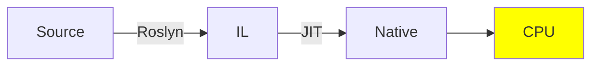
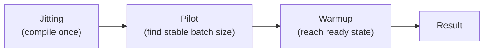

# BenchmarkDotNet fundamentals

// Intro here.

---

## Table of Contents

---

## Setup

```terminal
dotnet run -c Release
```

---

## Explanation

### Compilation flow



**Roslyn (recipe writing)**

The recipe writer (`Roslyn` compiler) turns C# source code into a universal recipe (Intermediate language `IL`). 

The recipe can be baked in any kitchen (Windows, Linux, etc.).

The recipe is stored in a box (`assembly`):

- if the box is marked `.exe`, its ingredients are ready to bake (`Main()`).

- if the box is marked `.dll`, its ingredients are not ready to bake until referenced by an .exe.

**JIT (recipe baking)**

The kitchen manager (`runtime`) hires the baker (`Just-In-Time` compiler) only when an order comes in (`lazy`).

The baker bakes the recipe using available equipment (`CPU specs`),

Serves it to the customer (`machine code`),

And keeps a copy of cake in the kitchen for future orders (`cache`).

### The four sources of runtime noise

The baker's performance can be affected by a noisy kitchen.

BenchmarkDotNet isolates the noise to reflect the performance of the recipe.

|Source|Description|Solution|
|-----|-----------|--------|
|**JIT**|The first bake takes time. A first bake contains significant compilation time.|Baking the recipe multiple times (`warmup`) and using the cached cake as control.|
|**GC**|Baking produces waste. When the garbage is collected, time is taken to clean up.|Forcing a cleanup between baking batches and mathematically subtracting the cleaning time from the result.|
|**ThreadPool**|Recipes that use threads (parallel tasks) need waiters to serve tables. Waiters can either idle (`overhead`) or tire (`starvation`), slowing down service.|Baking the recipe multiple time so that the waitstaff is stable (`steady state`).|
|**Optimizations**|The baker may skip steps (Dead Code Elimination) if the cake isn't eaten.|Returning the result so BenchmarkDotNet can "eat" it (consume it), forcing the baker to cook.|

## Tutorials

### Stage 1 - First benchmark

`[Benchmark]` marks the specific recipe (`method`) to be measured.

`BenchmarkRunner.Run<T>()` is the runner of the operation.

### The two kitchens workflow (sandboxing)

The runner uses two kitchens to bake the recipe.

Kitchen 1: **the host** (the process you launch with `dotnet run -c Release`).

This is were the recipe is **written and compiled**. Nothing is baked here.

Kitchen 2: **the child** (a fresh process, one per recipe).

This is were the recipe is **baked and executed**,

free from any noise from writing.

Each recipe in a run gets its own kitchen 2 (a brand-new OS process independent from the launch process).

See [StringConcatBenchmarks](src/StringConcatBenchmarks.cs).

```csharp
// src/Program.cs

public static void Main(string[] args)
{
    BenchmarkRunner.Run<StringConcatBenchmarks>();
}
```

```terminal
// Strings are immutable, so concatenation creates a new string each time. 
// StringBuilder is mutable, so it modifies the same object.
// In this case, efficiency depends on the allocation pattern complexity: O(n) vs O(n^2).

| Method              | Mean     | Error    | StdDev   |
|-------------------- |---------:|---------:|---------:|
| Concat              | 815.3 ns | 16.24 ns | 24.81 ns |
| StringBuilderAppend | 146.0 ns |  2.86 ns |  6.28 ns |
```

### Stage 2 - Reading the statistics

See [SumBenchmarks](src/SumBenchmarks.cs).



```terminal
// Mean = average cost per operation.
// StdDev = how much individual runs varied.
// StdErr = how much the Mean itself could be off.
// Error (table) = half the 99.9% confidence interval — the number to trust.

Mean = 394.221 ns, StdErr = 1.477 ns (0.37%), N = 14, StdDev = 5.527 ns

| Method       | Mean     | Error   | StdDev  |
|------------- |---------:|--------:|--------:|
| SumReturned  | 394.2 ns | 6.23 ns | 5.53 ns |
| SumDiscarded | 395.9 ns | 4.56 ns | 4.04 ns |
```

```terminal
SumReturned:   [388 ————————————— 400]
SumDiscarded:     [391 —————————— 400]

// One range sits almost entirely inside the other.
// You genuinely cannot say one method is faster.
```

```terminal
StringBuilder: [143 - 149]
Concat:                                              [799 —————— 832]

// Nowhere close to touching. 
// No ambiguity: Concat is unambiguously, provably slower.
```

**Gist**: `Mean` alone is a trap; `Error` is the real measure of trustworthiness. 

If the ranges overlap, you cannot say one method is faster than the other.

### Stage 3 - Isolating setup cost

See [SetupIsolationBenchmarks](src/SetupIsolationBenchmarks.cs).

When benchmarking using dependencies, the benchmark should isolate the dependency from the baking using `[GlobalSetup]`.

Otherwise, setup cost gets leaked into the results.

(e.g. opening a Redis `ConnectionMultiplexer` per call instead of once per baking).

```terminal
// Isolated: runs once per batch, not per operation.

[GlobalSetup]
public void Setup()
{
    _data = Enumerable.Range(1, 1000).Select(i => (double)i).ToArray();
}

// Non-isolated: runs once per operation, leaking setup cost into the results.
public double SumWithInlineSetup()
{        
    double[] data = Enumerable.Range(1, 1000).Select(i => (double)i).ToArray();
	...
```

```terminal
// Measures don't overlap at all: SumWithInlineSetup is provably slower.

| Method             | Mean     | Error    | StdDev   | Ratio | RatioSD |
|------------------- |---------:|---------:|---------:|------:|--------:|
| SumWithGlobalSetup | 395.9 ns |  5.57 ns |  5.21 ns |  1.00 |    0.02 |
| SumWithInlineSetup | 925.2 ns | 18.11 ns | 22.25 ns |  2.34 |    0.06 |
```

### Stage 4 - Params & arguments

See [DictionaryLookupBenchmarks](src/DictionaryLookupBenchmarks.cs).

`[Params]` is **class-level**: every recipe within the class is baked with those ingredients.

```terminal
// Dictionary lookup is O(1) and list lookup is O(n).
// N=10: statistically indistinguishable.
// N=1000: list lookup is 12x slower.
// N=100000: list lookup is 1243x slower, proving the O(n) complexity.

[Params(10, 1_000, 100_000)]

| Method           | N      | Mean         | Error      | StdDev     | Median       | Ratio    | RatioSD |
|----------------- |------- |-------------:|-----------:|-----------:|-------------:|---------:|--------:|
| DictionaryLookup | 10     |     3.452 ns |  0.0647 ns |  0.0605 ns |     3.446 ns |     1.00 |    0.02 |
| ListLookup       | 10     |     3.190 ns |  0.3549 ns |  1.0068 ns |     3.481 ns |     0.92 |    0.29 |
|                  |        |              |            |            |              |          |         |
| DictionaryLookup | 1000   |     3.505 ns |  0.1037 ns |  0.2444 ns |     3.481 ns |     1.00 |    0.10 |
| ListLookup       | 1000   |    42.410 ns |  0.8362 ns |  0.7413 ns |    42.511 ns |    12.16 |    0.87 |
|                  |        |              |            |            |              |          |         |
| DictionaryLookup | 100000 |     3.152 ns |  0.1007 ns |  0.1815 ns |     3.107 ns |     1.00 |    0.08 |
| ListLookup       | 100000 | 3,908.027 ns | 77.3207 ns | 85.9418 ns | 3,936.871 ns | 1,243.67 |   73.40 |
```

```terminal
[Params(10, 100, 1_000, 10_000, 100_000, 1_000_000)]

| Method           | N       | Mean          | Error       | StdDev      | Ratio     | RatioSD  |
|----------------- |-------- |--------------:|------------:|------------:|----------:|---------:|
| DictionaryLookup | 10      |      1.102 ns |   0.0528 ns |   0.0494 ns |      1.00 |     0.06 |
| ListLookup       | 10      |      1.330 ns |   0.0468 ns |   0.0558 ns |      1.21 |     0.07 |
|                  |         |               |             |             |           |          |
| DictionaryLookup | 100     |      1.032 ns |   0.0408 ns |   0.0382 ns |      1.00 |     0.05 |
| ListLookup       | 100     |      3.206 ns |   0.0871 ns |   0.0772 ns |      3.11 |     0.13 |
|                  |         |               |             |             |           |          |
| DictionaryLookup | 1000    |      1.095 ns |   0.0515 ns |   0.0506 ns |      1.00 |     0.06 |
| ListLookup       | 1000    |     27.709 ns |   0.5823 ns |   1.4284 ns |     25.35 |     1.75 |
|                  |         |               |             |             |           |          |
| DictionaryLookup | 10000   |      1.199 ns |   0.0417 ns |   0.0390 ns |      1.00 |     0.04 |
| ListLookup       | 10000   |    234.773 ns |   4.5379 ns |   5.2259 ns |    196.02 |     7.40 |
|                  |         |               |             |             |           |          |
| DictionaryLookup | 100000  |      1.211 ns |   0.0491 ns |   0.0459 ns |      1.00 |     0.05 |
| ListLookup       | 100000  |  2,293.211 ns |  26.7451 ns |  22.3333 ns |  1,895.65 |    70.77 |
|                  |         |               |             |             |           |          |
| DictionaryLookup | 1000000 |      1.222 ns |   0.0564 ns |   0.0554 ns |      1.00 |     0.06 |
| ListLookup       | 1000000 | 32,017.582 ns | 479.3180 ns | 512.8649 ns | 26,241.83 | 1,226.67 |

// For ListLookup, the bracket is Mean ± Error.
// StdErr = (Error / Mean) * 100; it shows that with larger N, the relative error decreases, making the results more trustworthy.
// If the StdErr would have been 2%, 15%, 40%... that would have been a red flag, indicating that the results were unreliable at scale.

N=10        [1.28 - 1.38]                                                    ±3.5%
N=100            [3.12 - 3.29]                                               ±2.7%
N=1,000               [27.1 —— 28.3]                                         ±2.1%
N=10,000                   [230 ——— 239]                                     ±1.9%
N=100,000                        [2,266 ————— 2,320]                         ±1.2%
N=1,000,000                            [31,538 ——————————— 32,497]           ±1.5%
```

See [ArgumentsBenchmarks](src/ArgumentsBenchmarks.cs).

`[Arguments]` is **method-level**: the specific recipe is baked with those ingredients (equivalent of `[Theory][InlineData]` in xUnit).

`[ArgumentsSource]` is an abstraction of `[Arguments]` that need more compute within a submethod.

```terminal
| Method   | n      | array         | Mean          | Error       | StdDev      |
|--------- |------- |-------------- |--------------:|------------:|------------:|
| SumRange | 10     | ?             |      2.573 ns |   0.0788 ns |   0.0774 ns |
| SumRange | 1000   | ?             |    249.767 ns |   3.2429 ns |   2.8747 ns |
| SumRange | 100000 | ?             | 24,850.428 ns | 326.2473 ns | 289.2098 ns |
| SumArray | ?      | Int32[100000] | 21,805.150 ns | 235.2706 ns | 208.5613 ns |
| SumArray | ?      | Int32[1000]   |    220.959 ns |   2.2871 ns |   2.0275 ns |
| SumArray | ?      | Int32[10]     |      2.827 ns |   0.0808 ns |   0.0756 ns |
```

At n = 100_000, the gap between SumRange and SumArray is statistically significant, proving that the array is faster than the range.

But this could be caused by noise rather than performance...

BDN provides tools for in-depth analysis of results.

### Stage 5 - Memory diagnoser

`[MemoryDiagnoser]` measures memory allocation and garbage collection.

It outputs those results as well, allowing to rule out those as source of performance difference:

```terminal
// Curiously, in this scoped test, SumArray is slower than SumRange.
// Zero bytes allocated for either method, which rules out allocation/GC as source of difference.

// SumRange is a register arithmetic loop, while SumArray is a memory scanning loop.
// We can conclude that the gap is due to memory (scanning) vs no-memory (register), which adds CPU cost.

// This can be proven further by using [DisassemblyDiagnoser].

| Method   | Mean     | Error    | StdDev   | Ratio | RatioSD | Allocated | Alloc Ratio |
|--------- |---------:|---------:|---------:|------:|--------:|----------:|------------:|
| SumRange | 24.99 us | 0.497 us | 0.843 us |  1.00 |    0.05 |         - |          NA |
| SumArray | 31.50 us | 0.594 us | 0.583 us |  1.26 |    0.05 |         - |          NA |
```

### Stage 6 - Disassembly diagnoser

`[DisassemblyDiagnoser]` adds a deeper lens by outputting the machine code generated by the JIT compiler:

```terminal
// SumRange is 17 bytes of code, SumArray 64 bytes (+73%).
// SumArray clearly performs a memory scan, which is real CPU cost.

## .NET 10.0.11 (10.0.11, 10.0.1126.37416), X64 RyuJIT x86-64-v3 (Job: DefaultJob)

; BenchmarkDotNetFundamentals.DisassemblyBenchmarks.SumRange()
;         int sum = 0;
;         ^^^^^^^^^^^^
;         for (int i = 0; i < N; i++)
;              ^^^^^^^^^
;             sum += i;
;             ^^^^^^^^^
;         return sum;
;         ^^^^^^^^^^^
       xor       eax,eax
       xor       ecx,ecx
M00_L00:
       add       eax,ecx
       inc       ecx
       cmp       ecx,186A0
       jl        short M00_L00
       ret
; Total bytes of code 17

## .NET 10.0.11 (10.0.11, 10.0.1126.37416), X64 RyuJIT x86-64-v3 (Job: DefaultJob)

; BenchmarkDotNetFundamentals.DisassemblyBenchmarks.SumArray()
;         int sum = 0;
;         ^^^^^^^^^^^^
;         for (int i = 0; i < _array.Length; i++)
;              ^^^^^^^^^
;             sum += _array[i];
;             ^^^^^^^^^^^^^^^^^
;         return sum;
;         ^^^^^^^^^^^
       sub       rsp,28
       xor       eax,eax
       xor       edx,edx
       mov       rcx,[rcx+8]
       cmp       dword ptr [rcx+8],0
       jle       short M00_L01
       nop       dword ptr [rax]
       nop       dword ptr [rax]
M00_L00:
       mov       r8,rcx
       cmp       edx,[r8+8]
       jae       short M00_L02
       add       eax,[r8+rdx*4+10]
       inc       edx
       cmp       [rcx+8],edx            // Memory load
       jg        short M00_L00
M00_L01:
       add       rsp,28
       ret
M00_L02:
       call      CORINFO_HELP_RNGCHKFAIL
       int       3
; Total bytes of code 64
```